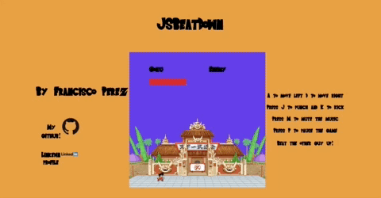

# JSBeatdown

### JSBeatdown

[JSBeatdown](http://francisco-perez.com/JSBeatDown/) is a fighting game/beat-em-up using recognizable characters from anime such as dragonball. The game is quite simple; beat the other guy up!

    

### Instructions

To start the game press space. The A and D keys move left and right, respectively. J to punch and K to kick. M mutes the music, P pauses the game.

### Technologies

The project was built using the following technologies:

-   `JavaScript` for game logic
-   `Canvas API` for animating background and sprites
-   `Webpack` for bundling JavaScript files

### Implementation

The game is structured as follows:

`index.js`: Tracks and updates game state (positions of characters, health values, game loop)

`sprite.js`: Sprite class that other sprites inherit from. This prevents repeated code.

`goku.js`: Sprite class for the playable character and first opponent. Contains 2D arrays with positions of sprite.

`ichigo.js`: Same as goku but for a different character. Some custom animations necessitate the need for a separate class.
